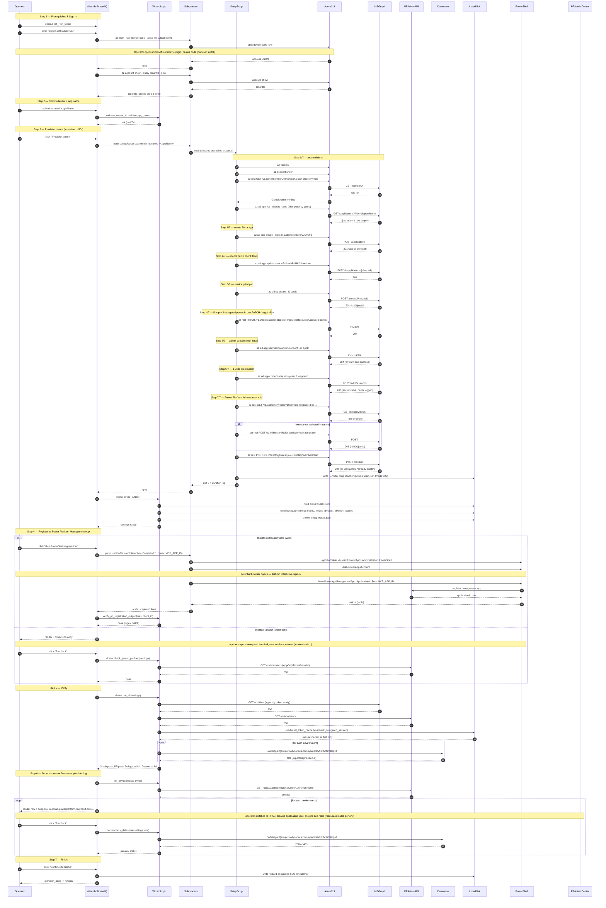

# First-Run Wizard Flow — Baseline Sequence Diagram

Baseline sequence diagram of the first-run setup wizard, captured **2026-05-15**.
This is the **current state**, not a target architecture. It exists so we can
spot optimization opportunities (attention switches, wall-time hotspots,
redundant API round-trips) before redesigning anything. Re-render in
<https://mermaid.live/> if you edit it.

## Sequence diagram

## Friction inventory

Observations only — each item is a place where operator attention switches
context or wall time is non-trivial. No remedies proposed here; that comes in
a follow-up session.

1. **Step 1 — device-code browser switch.** Operator leaves Streamlit/terminal
   to paste a code at `microsoft.com/devicelogin`, then returns.
2. **Step 3 — single ~50s blocking subprocess.** One `bash` call wrapping ten
   `az`/`az rest` invocations against Graph; the UI only sees streamed log
   lines, no per-call progress.
3. **Step 3 — round-trip on disk for one secret.** `.setup-output.json` is
   written by bash (mode 600), read by Python, then deleted, with
   `config.toml` written in between. Three FS touches for one handoff.
4. **Step 3 — Step 4/7 PATCH is the only step with a measured target (<5s).**
   The other ~nine `az` calls have no documented timings; total script
   duration is only known post-hoc from the script's own summary line.
5. **Step 4 — second auth surface.** `Add-PowerAppsAccount` may open a browser
   even though Step 1 already authenticated the operator via `az`.
6. **Step 4 — heterogeneous shell handoff.** Streamlit → `pwsh` subprocess →
   `Microsoft.PowerApps.Administration.PowerShell` module load on every run.
   Module import dominates pwsh wall time.
7. **Step 4 fallback — terminal switch.** Operator opens their own pwsh
   window, runs three cmdlets, returns to click Re-check. Two app switches
   plus a manual copy-paste.
8. **Step 5 — full doctor run despite known-failures.** Delegated session and
   Dataverse are both probed even though both are expected to fail
   pre-Step-6; the failures are informational only at this point.
9. **Step 6 — manual per-environment loop in PPAC.** Operator switches to
   `admin.powerplatform.microsoft.com` for *every* environment, creates an
   application user, assigns security roles, returns, clicks Re-check. Wall
   time scales linearly with environment count and dominates the wizard.
10. **Step 6 — Re-check is single-environment.** No batched re-verification
    across all envs; each row is its own round-trip.
11. **Cross-cutting — three independent token surfaces.** `az` CLI session
    (Step 1), Power Apps PowerShell session (Step 4), and the scanner's own
    app-only token via `AppOnlyTokenProvider` (Steps 5–6) all authenticate
    independently. No reuse.
12. **Cross-cutting — no concrete latency data.** Only the Step 4/7 PATCH has
    a documented target (<5s) and the script logs its own total duration;
    every other API call's cost is unknown. A measurement pass is a
    prerequisite to prioritizing the items above.
